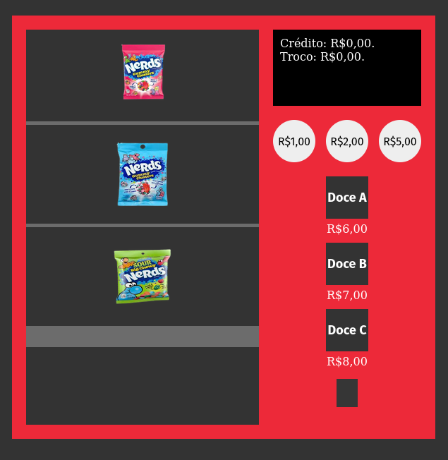
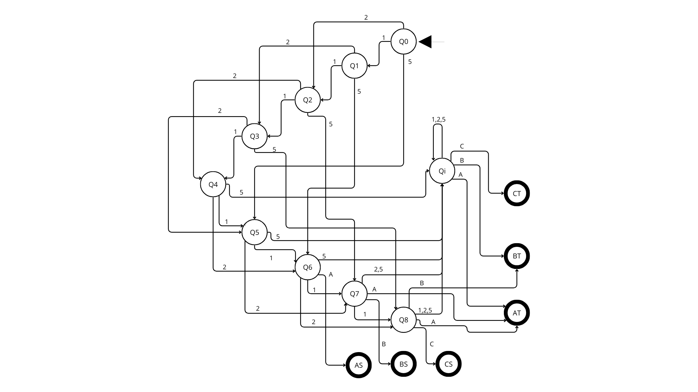

# Máquina de Venda de Doces - Autômato Finito Determinístico (AFD)

<<<<<<< HEAD
 <!-- Adicione uma imagem de preview se disponível -->
=======
 <!-- Adicione uma imagem de preview se disponível -->
>>>>>>> d4c555e (Atualizando o readme)

## Descrição do Projeto

Este projeto é uma implementação interativa de uma máquina de venda de doces baseada em um Autômato Finito Determinístico (AFD). A máquina permite que os usuários insiram moedas (R$1,00, R$2,00 e R$5,00) e selecionem doces (Doce A por R$6,00, Doce B por R$7,00 e Doce C por R$8,00), com animações que mostram o processo de compra e troco quando aplicável.

## Funcionalidades

- **Inserção de crédito**: Botões para inserir moedas de R$1,00, R$2,00 e R$5,00
- **Seleção de produtos**: Botões para escolher entre Doce A, B ou C
- **Display interativo**: Mostra o crédito atual e o troco
- **Animações**:
  - Queda do doce selecionado
  - Saída do troco em dinheiro

## Tecnologias Utilizadas

- HTML5
- CSS3
- JavaScript (ES6)

## Como Executar

1. Clone este repositório:
   ```bash
   git clone https://github.com/Guilhermeslsand/Case1.git
   
## Representação do Autômato

